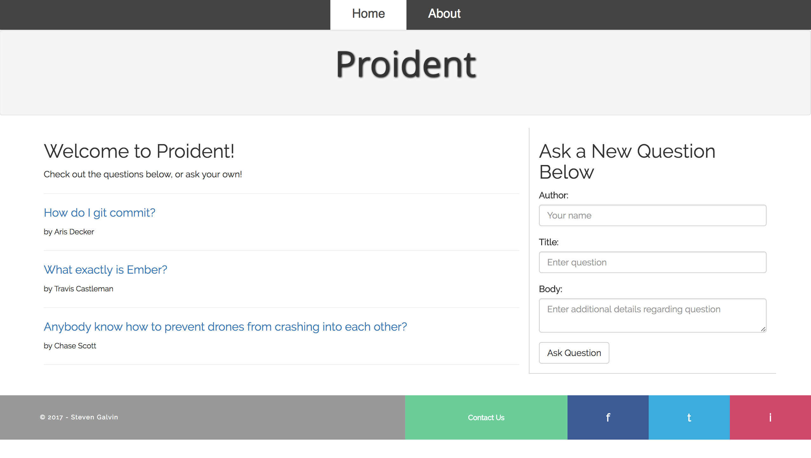

# Ask Me Anything

This Javascript app uses the Ember framework to build a question and answer message board. Similar to the likes of Reddit and Quora, it offers a platform for Junior Devs to ask questions for Senior Devs to answer. It's a great resource to learn more about the field as well as build relationships with fellow Devs, young and experienced alike.

### Planning

1. Configuration/dependencies
  The app will primarily use the Ember framework and the basics learned from my week at Epicodus. Stretch goals include learning and using more advanced aspects of Ember to organize questions by time or limit how many are displayed per page.

2. Specs
  * Spec 1: User can generate a questions and display it on the page.
  * Spec 2: CRUD functionality for questions.
  * Spec 3: User can create an answer and display it on the page.
  * Spec 4: Dynamic routing for questions.
  * Spec 5: One to many relationship between questions and answers allowing users to create specific answers to questions.
  * Spec 6: CRUD functionality for answers.

3. Integration
  * Initial routes or index pages with all dependencies in Controller/index.html head
  * Template/html page for home page.
  * Template/html page for about page.
  * Template/html page for contact page.
  * Template/html page for dynamic questions route.

4. UX/UI
  * Include Bootstrap, sass is a stretch goal.

5. Polish
  * Refactor code.
  * Delete unused code.
  * Make README awesome.

### Landing Page:

### Prerequisites

You will need the following things properly installed on your computer.

* [Git](https://git-scm.com/)
* [Node.js](https://nodejs.org/) (with NPM)
* [Ember CLI](https://ember-cli.com/)
* [PhantomJS](http://phantomjs.org/)

## Installation

As of writing this README, these instructions work on MacOS.

* `git clone <repository-url>` this repository
* `cd ask-me-anything`
* `npm install`

## Running / Development

* `ember serve`
* Visit your app at [http://localhost:4200](http://localhost:4200).

## Built With

* Ember
* HTML
* CSS/SASS
* Bootstrap https://getbootstrap.com/
* ES6
* Jquery https://jquery.com/
* Node
* Bower

## Authors

Steven Galvin

## Further Reading / Useful Links

* [ember.js](http://emberjs.com/)
* [ember-cli](https://ember-cli.com/)
* Development Browser Extensions
* [ember inspector for chrome](https://chrome.google.com/webstore/detail/ember-inspector/bmdblncegkenkacieihfhpjfppoconhi)
* [ember inspector for firefox](https://addons.mozilla.org/en-US/firefox/addon/ember-inspector/)

## License

MIT License

Copyright (c) Steven Galvin, 2017

Permission is hereby granted, free of charge, to any person obtaining a copy
of this software and associated documentation files (the "Software"), to deal
in the Software without restriction, including without limitation the rights
to use, copy, modify, merge, publish, distribute, sublicense, and/or sell
copies of the Software, and to permit persons to whom the Software is furnished to do so, subject to the following conditions:

The above copyright notice and this permission notice shall be included in all
copies or substantial portions of the Software.

THE SOFTWARE IS PROVIDED "AS IS", WITHOUT WARRANTY OF ANY KIND, EXPRESS OR
IMPLIED, INCLUDING BUT NOT LIMITED TO THE WARRANTIES OF MERCHANTABILITY,
FITNESS FOR A PARTICULAR PURPOSE AND NONINFRINGEMENT. IN NO EVENT SHALL THE
AUTHORS OR COPYRIGHT HOLDERS BE LIABLE FOR ANY CLAIM, DAMAGES OR OTHER
LIABILITY, WHETHER IN AN ACTION OF CONTRACT, TORT OR OTHERWISE, ARISING FROM,
OUT OF OR IN CONNECTION WITH THE SOFTWARE OR THE USE OR OTHER DEALINGS IN THE
SOFTWARE.
